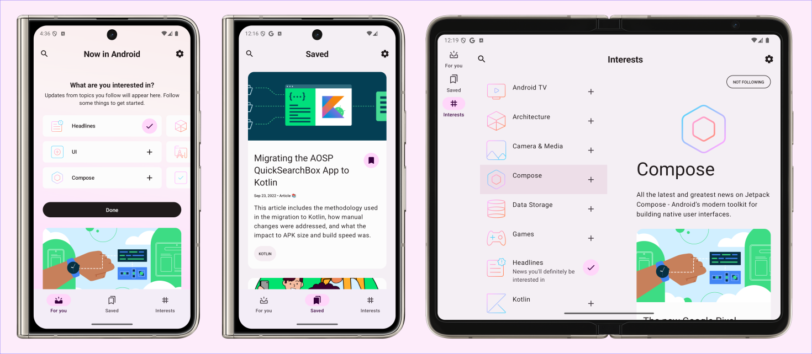

Now in Android App
==================

**Learn how this app was designed and built in the [design case study](https://goo.gle/nia-figma), [architecture learning journey](docs/ArchitectureLearningJourney.md) and [modularization learning journey](docs/ModularizationLearningJourney.md).**

This is the repository for the [Now in Android](https://developer.android.com/series/now-in-android)
app. It is a **work in progress** 🚧.

**Now in Android** is a fully functional Android app built entirely with Kotlin and Jetpack Compose. It
follows Android design and development best practices and is intended to be a useful reference
for developers. As a running app, it's intended to help developers keep up-to-date with the world
of Android development by providing regular news updates.

The app is currently in development. The `demoRelease` variant is [available on the Play Store in open beta](https://play.google.com/store/apps/details?id=com.google.samples.apps.nowinandroid).

# Features

**Now in Android** displays content from the
[Now in Android](https://developer.android.com/series/now-in-android) series. Users can browse for
links to recent videos, articles and other content. Users can also follow topics they are interested
in.

## Screenshots

# Development Environment

**Now in Android** uses the Gradle build system and can be imported directly into Android Studio (make sure you are using the latest stable version available [here](https://developer.android.com/studio)). 

Change the run configuration to `app`.

The `demoDebug` and `demoRelease` build variants can be built and run (the `prod` variants use a backend server which is not currently publicly available).

Once you're up and running, you can refer to the learning journeys below to get a better
understanding of which libraries and tools are being used, the reasoning behind the approaches to
UI, testing, architecture and more, and how all of these different pieces of the project fit
together to create a complete app.

NOTE: Building the app using an M1 Mac will require the use of
[Rosetta](https://support.apple.com/en-gb/HT211861). See
[the following bug](https://github.com/protocolbuffers/protobuf/issues/9397#issuecomment-1086138036)
for more details.

# Architecture

The **Now in Android** app follows the
[official architecture guidance](https://developer.android.com/topic/architecture) 
and is described in detail in the
[architecture learning journey](docs/ArchitectureLearningJourney.md).

# Modularization

The **Now in Android** app has been fully modularized and you can find the detailed guidance and
description of the modularization strategy used in
[modularization learning journey](docs/ModularizationLearningJourney.md).

# Build

The app contains the usual `debug` and `release` build variants. 

In addition, the `benchmark` variant of `app` is used to test startup performance and generate a
baseline profile (see below for more information).

`app-nia-catalog` is a standalone app that displays the list of components that are stylized for
**Now in Android**.

The app also uses
[product flavors](https://developer.android.com/studio/build/build-variants#product-flavors) to
control where content for the app should be loaded from.

The `demo` flavor uses static local data to allow immediate building and exploring of the UI.

The `prod` flavor makes real network calls to a backend server, providing up-to-date content. At 
this time, there is not a public backend available.

For normal development use the `demoDebug` variant. For UI performance testing use the
`demoRelease` variant. 

# Testing

To facilitate testing of components, **Now in Android** uses dependency injection with
[Hilt](https://developer.android.com/training/dependency-injection/hilt-android).

Most data layer components are defined as interfaces.
Then, concrete implementations (with various dependencies) are bound to provide those interfaces to
other components in the app.
In tests, **Now in Android** notably does _not_ use any mocking libraries.
Instead, the production implementations can be replaced with test doubles using Hilt's testing APIs
(or via manual constructor injection for `ViewModel` tests).

These test doubles implement the same interface as the production implementations and generally
provide a simplified (but still realistic) implementation with additional testing hooks.
This results in less brittle tests that may exercise more production code, instead of just verifying
specific calls against mocks.

Examples:
- In instrumentation tests, a temporary folder is used to store the user's preferences, which is
  wiped after each test.
  This allows using the real `DataStore` and exercising all related code, instead of mocking the 
  flow of data updates.

- There are `Test` implementations of each repository, which implement the normal, full repository
  interface and also provide test-only hooks.
  `ViewModel` tests use these `Test` repositories, and thus can use the test-only hooks to
  manipulate the state of the `Test` repository and verify the resulting behavior, instead of
  checking that specific repository methods were called.

# UI
The app was designed using [Material 3 guidelines](https://m3.material.io/). Learn more about the design process and 
obtain the design files in the [Now in Android Material 3 Case Study](https://goo.gle/nia-figma) (design assets [also available as a PDF](docs/Now-In-Android-Design-File.pdf)).

The Screens and UI elements are built entirely using [Jetpack Compose](https://developer.android.com/jetpack/compose). 

The app has two themes: 

- Dynamic color - uses colors based on the [user's current color theme](https://material.io/blog/announcing-material-you) (if supported)
- Default theme - uses predefined colors when dynamic color is not supported

Each theme also supports dark mode. 

The app uses adaptive layouts to
[support different screen sizes](https://developer.android.com/guide/topics/large-screens/support-different-screen-sizes).

Find out more about the [UI architecture here](docs/ArchitectureLearningJourney.md#ui-layer).

# Baseline profiles

The baseline profile for this app is located at [`app/src/main/baseline-prof.txt`](app/src/main/baseline-prof.txt).
It contains rules that enable AOT compilation of the critical user path taken during app launch.
For more information on baseline profiles, read [this document](https://developer.android.com/studio/profile/baselineprofiles).

> Note: The baseline profile needs to be re-generated for release builds that touch code which changes app startup.

To generate the baseline profile, select the `benchmark` build variant and run the
`BaselineProfileGenerator` benchmark test on an AOSP Android Emulator.
Then copy the resulting baseline profile from the emulator to [`app/src/main/baseline-prof.txt`](app/src/main/baseline-prof.txt).

# License

**Now in Android** is distributed under the terms of the Apache License (Version 2.0). See the
[license](LICENSE) for more information.
