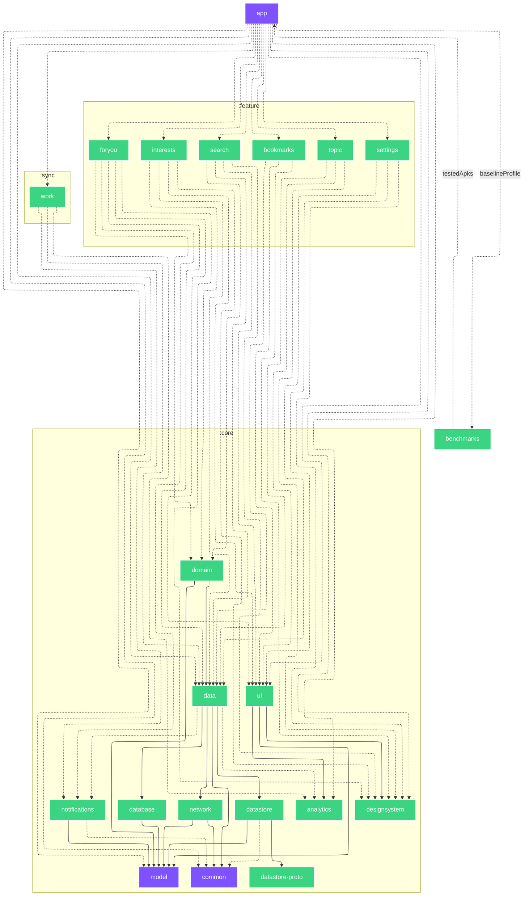

# `:benchmarks`

<!--region graph-->

```mermaid
---
config:
  layout: elk
  elk:
    nodePlacementStrategy: SIMPLE
---
graph TB
  subgraph :core
    direction TB
    :core:analytics[analytics]:::android-library
    :core:common[common]:::jvm
    :core:data[data]:::android-library
    :core:database[database]:::android-library
    :core:datastore[datastore]:::android-library
    :core:datastore-proto[datastore-proto]:::android-library
    :core:designsystem[designsystem]:::android-library
    :core:domain[domain]:::android-library
    :core:model[model]:::jvm
    :core:network[network]:::android-library
    :core:notifications[notifications]:::android-library
    :core:ui[ui]:::android-library
  end
  subgraph :feature
    direction TB
    :feature:bookmarks[bookmarks]:::android-library
    :feature:foryou[foryou]:::android-library
    :feature:interests[interests]:::android-library
    :feature:search[search]:::android-library
    :feature:settings[settings]:::android-library
    :feature:topic[topic]:::android-library
  end
  subgraph :sync
    direction TB
    :sync:work[work]:::android-library
  end
  :benchmarks[benchmarks]:::android-test
  :app[app]:::android-application

  :app -.->|baselineProfile| :benchmarks
  :app -.-> :core:analytics
  :app -.-> :core:common
  :app -.-> :core:data
  :app -.-> :core:designsystem
  :app -.-> :core:model
  :app -.-> :core:ui
  :app -.-> :feature:bookmarks
  :app -.-> :feature:foryou
  :app -.-> :feature:interests
  :app -.-> :feature:search
  :app -.-> :feature:settings
  :app -.-> :feature:topic
  :app -.-> :sync:work
  :benchmarks -.->|testedApks| :app
  :core:data -.-> :core:analytics
  :core:data ---> :core:common
  :core:data ---> :core:database
  :core:data ---> :core:datastore
  :core:data ---> :core:network
  :core:data -.-> :core:notifications
  :core:database ---> :core:model
  :core:datastore -.-> :core:common
  :core:datastore ---> :core:datastore-proto
  :core:datastore ---> :core:model
  :core:domain ---> :core:data
  :core:domain ---> :core:model
  :core:network ---> :core:common
  :core:network ---> :core:model
  :core:notifications -.-> :core:common
  :core:notifications ---> :core:model
  :core:ui ---> :core:analytics
  :core:ui ---> :core:designsystem
  :core:ui ---> :core:model
  :feature:bookmarks -.-> :core:data
  :feature:bookmarks -.-> :core:designsystem
  :feature:bookmarks -.-> :core:ui
  :feature:foryou -.-> :core:data
  :feature:foryou -.-> :core:designsystem
  :feature:foryou -.-> :core:domain
  :feature:foryou -.-> :core:notifications
  :feature:foryou -.-> :core:ui
  :feature:interests -.-> :core:data
  :feature:interests -.-> :core:designsystem
  :feature:interests -.-> :core:domain
  :feature:interests -.-> :core:ui
  :feature:search -.-> :core:data
  :feature:search -.-> :core:designsystem
  :feature:search -.-> :core:domain
  :feature:search -.-> :core:ui
  :feature:settings -.-> :core:data
  :feature:settings -.-> :core:designsystem
  :feature:settings -.-> :core:ui
  :feature:topic -.-> :core:data
  :feature:topic -.-> :core:designsystem
  :feature:topic -.-> :core:ui
  :sync:work -.-> :core:analytics
  :sync:work -.-> :core:data
  :sync:work -.-> :core:notifications

classDef android-application fill:#7F52FF,stroke:#fff,stroke-width:2px,color:#fff;
classDef android-library fill:#3BD482,stroke:#fff,stroke-width:2px,color:#fff;
classDef android-test fill:#3BD482,stroke:#fff,stroke-width:2px,color:#fff;
classDef jvm fill:#7F52FF,stroke:#fff,stroke-width:2px,color:#fff;
classDef unknown fill:#FF0000,stroke:#fff,stroke-width:2px,color:#fff;
```
<!--endregion-->
