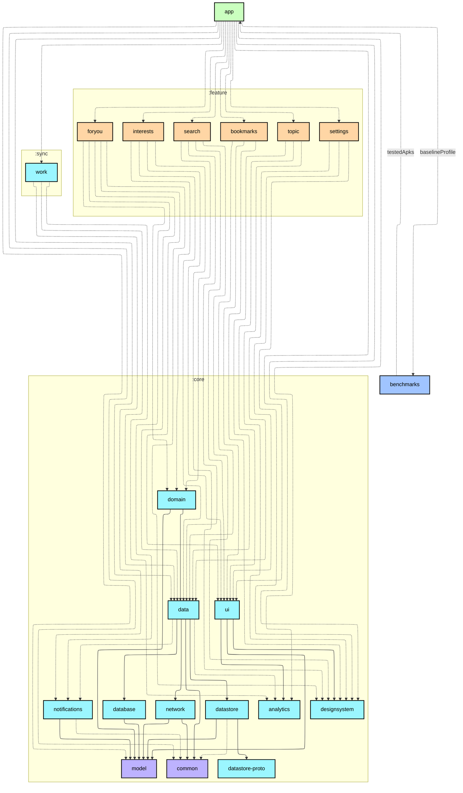
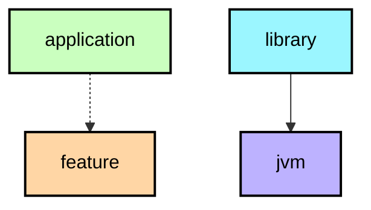

<<<<<<< HEAD
# `:benchmarks`

## Module dependency graph

<!--region graph-->

📋 Graph legend

<!--endregion-->
=======
# :benchmarks module
## Dependency graph

>>>>>>> a059e426 (Update readme and build dependency graph)
