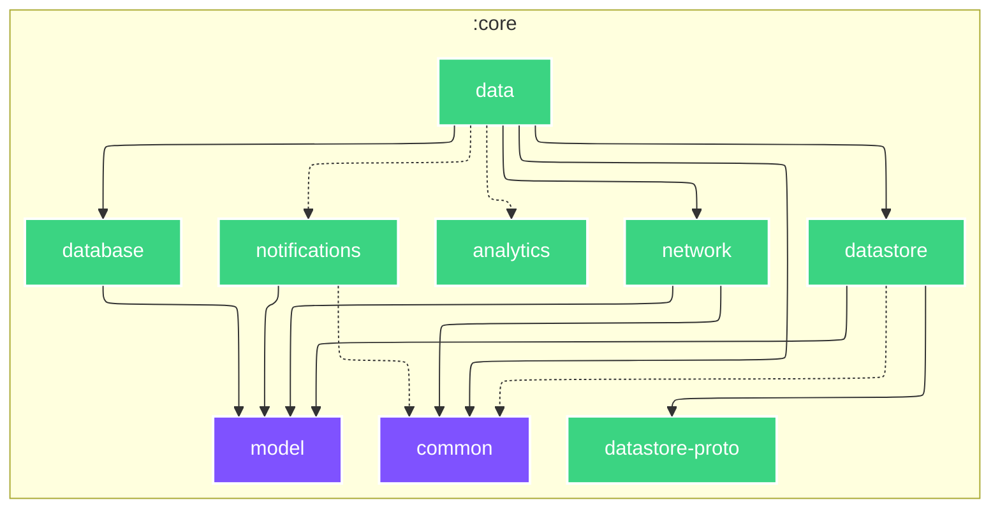

# `:core:data`

<!--region graph-->

```mermaid
---
config:
  layout: elk
  elk:
    nodePlacementStrategy: SIMPLE
---
graph TB
  subgraph :core
    direction TB
    :core:analytics[analytics]:::android-library
    :core:common[common]:::jvm
    :core:data[data]:::android-library
    :core:database[database]:::android-library
    :core:datastore[datastore]:::android-library
    :core:datastore-proto[datastore-proto]:::android-library
    :core:model[model]:::jvm
    :core:network[network]:::android-library
    :core:notifications[notifications]:::android-library
  end

  :core:data -.-> :core:analytics
  :core:data ---> :core:common
  :core:data ---> :core:database
  :core:data ---> :core:datastore
  :core:data ---> :core:network
  :core:data -.-> :core:notifications
  :core:database ---> :core:model
  :core:datastore -.-> :core:common
  :core:datastore ---> :core:datastore-proto
  :core:datastore ---> :core:model
  :core:network ---> :core:common
  :core:network ---> :core:model
  :core:notifications -.-> :core:common
  :core:notifications ---> :core:model

classDef android-application fill:#7F52FF,stroke:#fff,stroke-width:2px,color:#fff;
classDef android-library fill:#3BD482,stroke:#fff,stroke-width:2px,color:#fff;
classDef android-test fill:#3BD482,stroke:#fff,stroke-width:2px,color:#fff;
classDef jvm fill:#7F52FF,stroke:#fff,stroke-width:2px,color:#fff;
classDef unknown fill:#FF0000,stroke:#fff,stroke-width:2px,color:#fff;
```
<!--endregion-->
