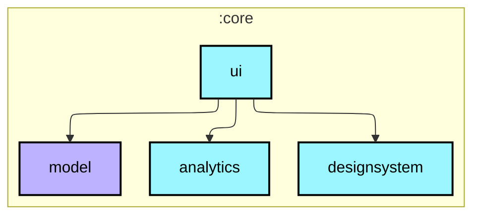

# `:core:ui`

## Module dependency graph

<!--region graph-->

```mermaid
---
config:
  layout: elk
  elk:
    nodePlacementStrategy: SIMPLE
---
graph TB
  subgraph :core
    direction TB
    :core:analytics[analytics]:::android-library
    :core:designsystem[designsystem]:::android-library
    :core:model[model]:::jvm-library
    :core:ui[ui]:::android-library
  end

  :core:ui ---> :core:analytics
  :core:ui ---> :core:designsystem
  :core:ui ---> :core:model

classDef android-application fill:#CAFFBF,stroke:#000,stroke-width:2px,color:#000;
classDef android-feature fill:#FFD6A5,stroke:#000,stroke-width:2px,color:#000;
classDef android-library fill:#9BF6FF,stroke:#000,stroke-width:2px,color:#000;
classDef android-test fill:#A0C4FF,stroke:#000,stroke-width:2px,color:#000;
classDef jvm-library fill:#BDB2FF,stroke:#000,stroke-width:2px,color:#000;
classDef unknown fill:#FFADAD,stroke:#000,stroke-width:2px,color:#000;
```
<!--endregion-->
