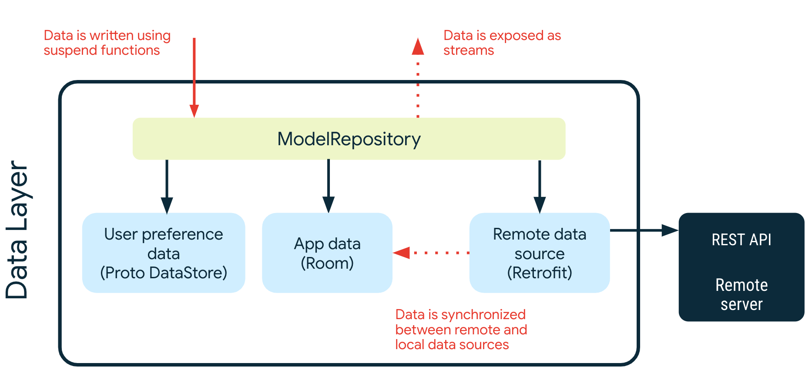

# Architecture Learning Journey

In this learning journey you will learn about the Now in Android app architecture: its layers, key classes and the interactions between them.

## Goals and requirements

The goals for the app architecture are:

*   Follow the [official architecture guidance](https://developer.android.com/jetpack/guide) as closely as possible.
*   Easy for developers to understand, nothing too experimental.
*   Support multiple developers working on the same codebase.
*   Facilitate local and instrumented tests, both on the developer’s machine and using Continuous Integration (CI).
*   Minimize build times.

## Architecture overview

The app architecture has two layers: a [data layer](https://developer.android.com/jetpack/guide/data-layer) and [UI layer](https://developer.android.com/jetpack/guide/ui-layer) (a third, [the domain layer](https://developer.android.com/jetpack/guide/domain-layer), is currently in development).

The architecture follows a reactive programming model with [unidirectional data flow](https://developer.android.com/jetpack/guide/ui-layer#udf). With the data layer at the bottom, the key concepts are:

*   Higher layers react to changes in lower layers.
*   Events flow down.
*   Data flows up.

The data flow is achieved using streams, implemented using [Kotlin Flows](https://developer.android.com/kotlin/flow).

**Example: Displaying news on the For You screen**

When the app is first run it will attempt to load a list of news resources from a remote server (when the `staging` or `release` build variant is selected, `debug` builds will use local data). Once loaded, these are shown to the user based on the interests they choose.

The following diagram shows the events which occur and how data flows from the relevant objects to achieve this.

Here's the code which corresponds to each step. The easiest way to jump to the code is to load the project into Android Studio and search for the following:

1) Search for instances of `ForYouFeedState.Loading`

2) See `SyncWorker#doWork`

3&6) See `OfflineFirstNewsRepository#syncWith`

4&5) See `RetrofitNiaNetwork#getNewsResources`

7) See `NewsResourceDao#getNewsResourcesStream`

8) See `OfflineFirstNewsRespository#getNewsResourcesStream`

9) Search for instances of `ForYouFeedState.Success`

## Data layer

The data layer is implemented as an offline-first source of app data and business logic. It is the source of truth for all data in the app.

Each repository has its own model. For example, the `TopicsRepository` has a `Topic` model and the `NewsRepository` has a `NewsResource` model.

Repositories are the public API for other layers, they provide the _only_ way to access the app data. The repositories typically offer one or more methods for reading and writing data.

### Reading data

Data is obtained using data streams. This means each client of the repository must be prepared to react to data changes. Data is not exposed as a snapshot (e.g. `getModel`) because there's no guarantee that it will still be valid by the time it is used.

_Example: Read a list of authors_

A list of `Author`s can be obtained by calling `AuthorsRepository.getAuthorsStream()`. This returns a `Flow<List<Author>>`.

Whenever the list of authors changes (for example, when a new author is added), the updated `List&lt;Author>` is emitted into the stream.

### Writing data

To write data, the repository provides suspend functions. It is up to the caller to ensure that their execution is suitably scoped.

_Example: Follow a topic _

Simply call `TopicsRepository.setFollowedTopicId` with the ID of the topic which the user wishes to follow.

### Data sources

A repository may depend on one or more data sources. For example, the `OfflineFirstTopicsRepository` depends on the following data sources:

<table>
  <tr>
   <td><strong>Name</strong>
   </td>
   <td><strong>Backed by</strong>
   </td>
   <td><strong>Purpose</strong>
   </td>
  </tr>
  <tr>
   <td>TopicsDao
   </td>
   <td>Room/SQLite
   </td>
   <td>Persistent relational data associated with Topics
   </td>
  </tr>
  <tr>
   <td>NiaPreferences
   </td>
   <td>Proto DataStore
   </td>
   <td>Persistent unstructured data associated with user preferences, specifically which Topics the user is interested in. This is defined and modeled in a .proto file, using the protobuf syntax.
   </td>
  </tr>
  <tr>
   <td>NiANetwork
   </td>
   <td>Remote API accessed using Retrofit
   </td>
   <td>Data for topics, provided through REST API endpoints as JSON. 
   </td>
  </tr>
</table>

Repositories are also responsible for liaising with any remote data sources. Repositories are syncable (they implement `Syncable`), which means they can synchronize data from a remote data source with a local data source.

This is achieved in the `syncWith` method which takes a `Synchronizer` as a parameter. The `Synchronizer` will keep attempting to sync the repository until it successfully completes. In the case of errors, the sync is retried with exponential backoff.

## UI Layer

The [UI layer](https://developer.android.com/topic/architecture/ui-layer) comprises:

*   UI elements built using [Jetpack Compose](https://developer.android.com/jetpack/compose)
*   [Android ViewModels](https://developer.android.com/topic/libraries/architecture/viewmodel)

The view models receive streams of data from repositories and transform them into UI state. The UI elements reflect this state, and provide ways for the user to interact with the app. These interactions are passed as events to the view model where they are processed.

### Modeling UI state

UI state is modeled as a sealed hierarchy using interfaces and immutable data classes. State objects are only ever emitted through the transform of data streams. This approach ensures that:

*   the UI state always represents the underlying app data - the app data is the source-of-truth.
*   the UI elements handle all possible states.

**Example: News feed on For You screen**

The feed (a list) of news resources on the For You screen is modeled using `ForYouFeedState`. This is a sealed interface which creates a hierarchy of two possible states:

*   `Loading` indicates that the data is loading
*   `Success` indicates that the data was loaded successfully. The Success state contains the list of news resources.

The `feedState` is passed to the `ForYouScreen` composable, which handles both of these states.

### Transforming streams into UI state

View models receive streams of data as cold [flows](https://kotlin.github.io/kotlinx.coroutines/kotlinx-coroutines-core/kotlinx.coroutines.flow/-flow/index.html) from one or more repositories. These are [combined](https://kotlin.github.io/kotlinx.coroutines/kotlinx-coroutines-core/kotlinx.coroutines.flow/combine.html) together to produce a single flow of UI state. This single flow is then converted to a hot flow using [stateIn](https://kotlin.github.io/kotlinx.coroutines/kotlinx-coroutines-core/kotlinx.coroutines.flow/state-in.html). The conversion to a hot flow enables UI elements to read the last known state from the flow.

**Example: Displaying followed topics and authors**

The `FollowingViewModel` exposes `uiState` as a `StateFlow<FollowingUiState>`. This hot flow is created by combining four data streams:

*   List of authors (getAuthorsStream)
*   List of author IDs which the current user is following
*   List of topics
*   List of topic IDs which the current user is following

The list of `Author`s is mapped to a new list of `FollowableAuthor`s. `FollowableAuthor` is a wrapper for `Author` which also indicates whether the current user is following that author. The same transformation is applied for the list of `Topic`s.

The two new lists are used to create a `FollowingUiState.Interests` state which is exposed to the UI.

### Processing user interactions

User actions are communicated from UI elements to view models using regular method invocations. These methods are passed to the UI elements as lambda expressions.

**Example: Following a topic**

The `FollowingScreen` takes a lambda expression named `followTopic` which is supplied from `FollowingViewModel.followTopic`. Each time the user taps on a topic to follow this method is called. The view model then processes this action by informing the topics repository.

## Further reading

[Guide to app architecture](https://developer.android.com/topic/architecture)

[Jetpack Compose](https://developer.android.com/jetpack/compose)
